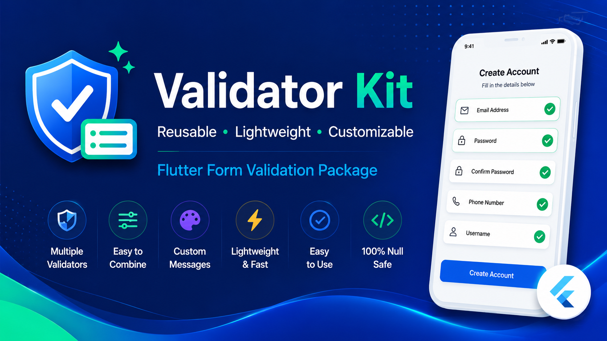
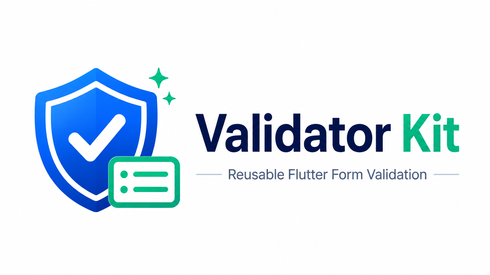
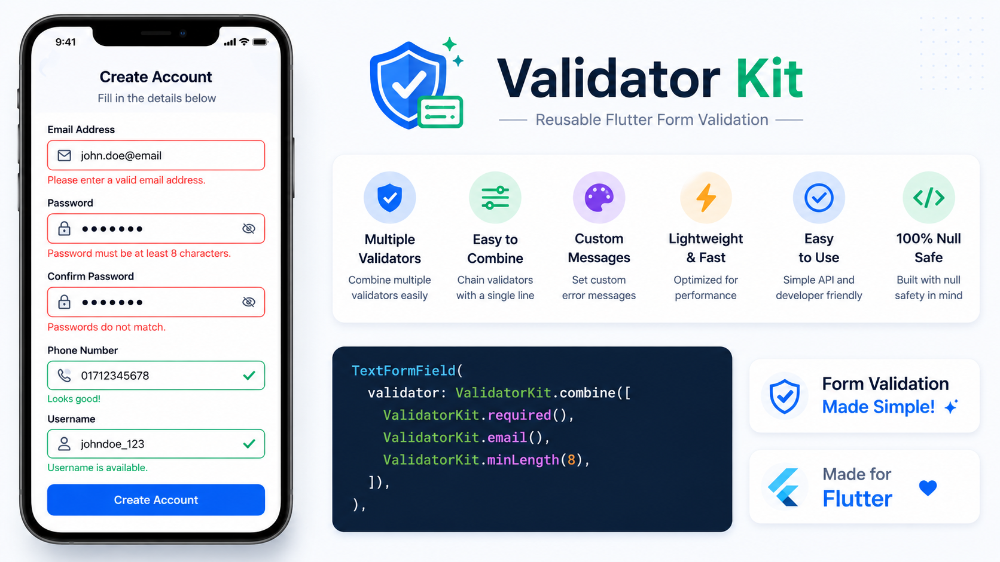
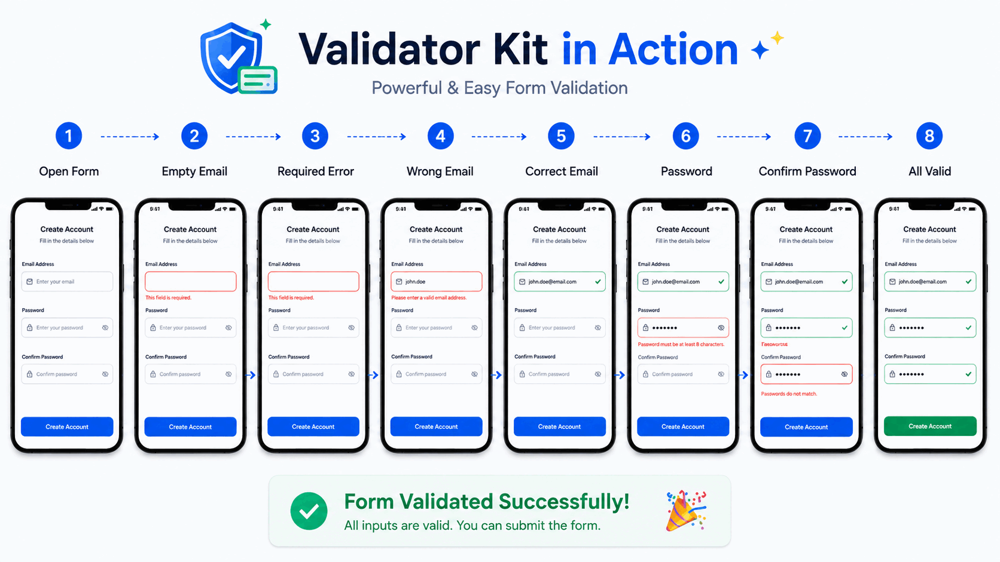

<p align="center">
  
</p>

<h1 align="center">Validator Kit</h1>

<p align="center">
A lightweight, reusable, customizable and null-safe Flutter form validation package.
</p>

<p align="center">

[](https://pub.dev/packages/validator_kit)
[](LICENSE)
[](https://flutter.dev)

</p>

---

<p align="center">
  
</p>

## ✨ Features

- ✅ Required Validator
- ✅ Email Validator
- ✅ Phone Validator
- ✅ URL Validator
- ✅ Username Validator
- ✅ Password Validator
- ✅ Confirm Password Validator
- ✅ Number Validator
- ✅ Pattern Validator
- ✅ Minimum Length Validator
- ✅ Maximum Length Validator
- ✅ Combine Multiple Validators
- ✅ Custom Error Messages
- ✅ Fully Null-safe
- ✅ Lightweight & Fast
- ✅ Easy to Use
- ✅ Reusable Across Projects

---

# 📱 Preview

<p align="center">
  
</p>

---

# 🎬 Demo

<p align="center">
  
</p>

---

# 📦 Installation

Add the package to your **pubspec.yaml**

```yaml
dependencies:
  validator_kit: ^0.0.1
```

Then run

```bash
flutter pub get
```

---

# 🚀 Import

```dart
import 'package:validator_kit/validator_kit.dart';
```

---

# ⚡ Quick Start

```dart
TextFormField(
  validator: ValidatorKit.combine([
    ValidatorKit.required(),
    ValidatorKit.email(),
  ]),
)
```

---

# 📚 Available Validators

## Required

```dart
ValidatorKit.required()
```

---

## Email

```dart
ValidatorKit.email()
```

---

## Phone

```dart
ValidatorKit.phone()
```

---

## URL

```dart
ValidatorKit.url()
```

---

## Username

```dart
ValidatorKit.username()
```

---

## Password

```dart
ValidatorKit.password()
```

---

## Confirm Password

```dart
ValidatorKit.confirmPassword(
  () => passwordController.text,
)
```

---

## Number

```dart
ValidatorKit.number()
```

---

## Pattern

```dart
ValidatorKit.pattern(
  RegExp(r'^[A-Z]{3}[0-9]{4}$'),
  message: 'Invalid Employee ID',
)
```

---

## Minimum Length

```dart
ValidatorKit.minLength(8)
```

---

## Maximum Length

```dart
ValidatorKit.maxLength(30)
```

---

## Combine Validators

```dart
validator: ValidatorKit.combine([
  ValidatorKit.required(),
  ValidatorKit.email(),
  ValidatorKit.minLength(8),
])
```

---

## Disable Validation

If you want to disable validation conditionally:

```dart
ValidatorKit.none()
```

Example

```dart
validator: isGuest
    ? ValidatorKit.none()
    : ValidatorKit.required(),
```

---

## Custom Error Message

```dart
ValidatorKit.email(
  message: 'Please enter a valid email.',
)
```

---

# 💻 Complete Example

```dart
TextFormField(
  decoration: const InputDecoration(
    labelText: 'Email',
  ),
  validator: ValidatorKit.combine([
    ValidatorKit.required(),
    ValidatorKit.email(),
    ValidatorKit.minLength(8),
  ]),
)
```

---

# ❤️ Why Validator Kit?

- Clean API
- Highly reusable
- Easy to combine validators
- Supports custom error messages
- Null-safe
- Lightweight
- Production ready
- Perfect for Flutter Forms

---

# 🛣️ Roadmap

Upcoming features

- 🌍 Localization Support
- 📅 Date Validator
- 💳 Credit Card Validator
- 🌐 IPv4 & IPv6 Validator
- 🆔 IBAN Validator
- 🏳 Country-specific Phone Validation
- ⏳ Async Validators
- 🔥 Custom Validator Builder
- 📝 File Validator
- 📦 OTP Validator

---

# 🤝 Contributing

Contributions are welcome!

If you'd like to improve Validator Kit, feel free to open an issue or submit a pull request.

---

# ⭐ Support

If you like this package, please give it a ⭐ on GitHub.

It helps the project grow and motivates future improvements.

---
## 🤝 Connect with Me

If this package helps you, feel free to connect.

- 💻 GitHub: https://github.com/Dev-SohelRana
- 💼 LinkedIn: https://www.linkedin.com/in/mdsohelrana201/
- 🌐 Portfolio: https://dev-sohelrana.github.io/sohelrana-portfolio/

---

# 📄 License

This project is licensed under the MIT License.